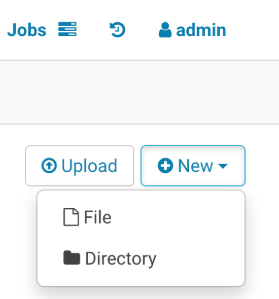
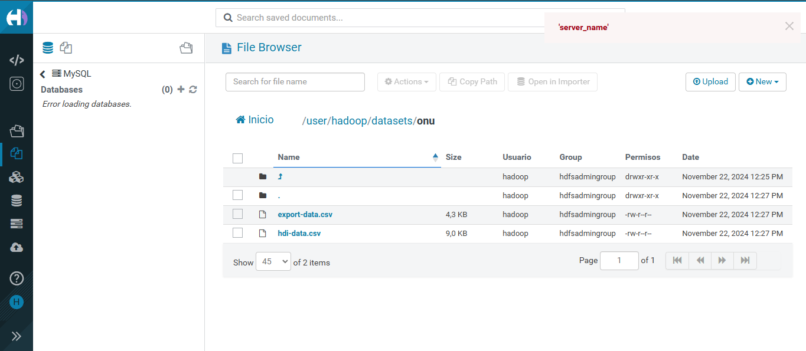
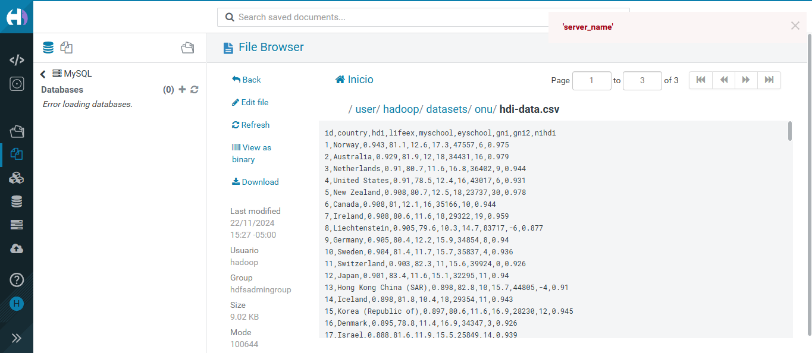

# Laboratorio 3-1 Hadoop

El desarrollo de este laboratorio puede realizarse por dos medios, línea de comandos a travpes del terminal o a través de la interfaz de usuario de Hue en el navegador. 


# A través de comandos en terminal

Una vez creado el clúster EMR en Amazon AWS, debemos de conectarnos al nodo master a través del siguiente comando en terminal:

```bash
ssh -i "laboratorio-3.pem" hadoop@ec2-3-234-143-224.compute-1.amazonaws.com 
```

Una vez conectados al nodo master, debemos de instalar git.

```bash
sudo yum install git
```

Posterior a esto clonamos el repositorio. 

```bash
git clone https://github.com/st0263eafit/st0263-242.git
```

Ahora creamos nuestro propio directorio 'datasets' en HDFS.

```bash
hdfs dfs -mkdir /user/hadoop/datasets
```

Ahora creamos el directorio 'gutenberg-small'. 

```bash
hdfs dfs -mkdir /user/hadoop/datasets/gutenberg-small
```

Ahora debemos de subir todos los archivos .txt que se encuentran en el directorio de manera local al sistema de hadoop.

```bash
hdfs dfs -put /home/hadoop/st0263-242/bigdata/datasets/gutenberg-small/*.txt /user/hadoop/datasets/gutenberg-small/
```

Ahora creamos un directorio llamado 'mis_datasets'.

```bash
sudo mkdir /home/hadoop/mis_datasets/
```

Ahora, a través del comando '-get', descargamos todo el contenido de 'gutenberg-small' a 'mis_datasets'.

```bash
sudo hdfs dfs -get /user/hadoop/datasets/gutenberg-small/* ~hadoop/mis_datasets/
```


# A través de la interfaz de usuario en Hue

Ingresamos a Hue utilizando el usuario 'hadoop' y nuestra contraseña.

Una vez hayamos ingresado, vamos a files y creamos un nuevo directorio llamado datasets.

### Crear directorio datasets


Ahora creamos otro directorio llamado onu.

### Crear directorio onu 


Ahora debemos cargar los archivos que desamos y verificar su carga. 

### Carga de archivos



